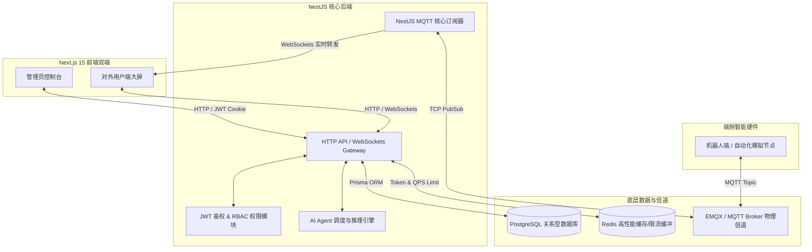

# XBNEST 智能后端系统架构设计说明

本项目为一套高性能、高吞吐、强安全的**智能后台控制与对外用户端一体化系统**的核心后端服务。采用 NestJS 框架，将所有重逻辑、物理通信、数据库 ORM 以及 AI 推理进行模块化实现。

---

## 1. 系统核心拓扑架构

后端在整个系统中处于核心枢纽地位，连接数据库、Redis、EMQX 消息信道、AI 推理引擎，并为前端提供 HTTP 与 WebSockets 双通信接口。

---

## 2. 后端核心技术栈选型

*   **开发框架**：NestJS 11.x + TypeScript，基于模块化依赖注入设计。
*   **ORM 与数据库**：Prisma Client + PostgreSQL。支持严格的外键约束、级联删除与高性能联合索引。
*   **缓存与限流**：Redis。用于存储登录 Token 黑名单、接口请求速率限制 (QPS Limit) 以及设备在线心跳状态缓存。
*   **物理通信信道**：
    *   `@nestjs/microservices` (MQTT) 对接 EMQX，与端侧设备高频物理通信；
    *   `@nestjs/websockets` (Socket.IO) 对接用户前端，为实时日志和自检提供高并发推送通道。

---

## 3. 后端核心功能模块

### 3.1 账号鉴权与 RBAC 权限控制
提供基于 JWT 的安全令牌校验，用户端与管理端账号实行不同表的物理隔离。提供 401 队列挂起与无感自动续期刷新 Token 机制。

### 3.2 注册码激活与设备限流
批量生成的授权激活码与端侧设备的 MAC/IP 绑定。在 Redis 中记录该激活码的 QPS（如 5 Req/Sec），通过限流拦截器进行实时拦截，防止端侧恶意刷屏，保障系统带宽安全。

### 3.3 高并发实时脚本日志
端侧设备将自身的脚本日志（正常自检、波动警告、致命故障）通过 MQTT 投递到 EMQX。NestJS 的订阅拦截器接收到消息后，根据绑定的激活码所有者，进行精准的用户隔离，通过 Socket.IO 发送给订阅了该设备的用户端。

### 3.4 AI Agent 智能任务调试
集成 DeepSeek 等多模型，提供自然语言的系统操控能力。支持热配置 Temperature 与 System Prompt，支持输出思维链（think 标签内容），并伴有 Agent 工具调用 Timeline 时序节点的物理联动。
